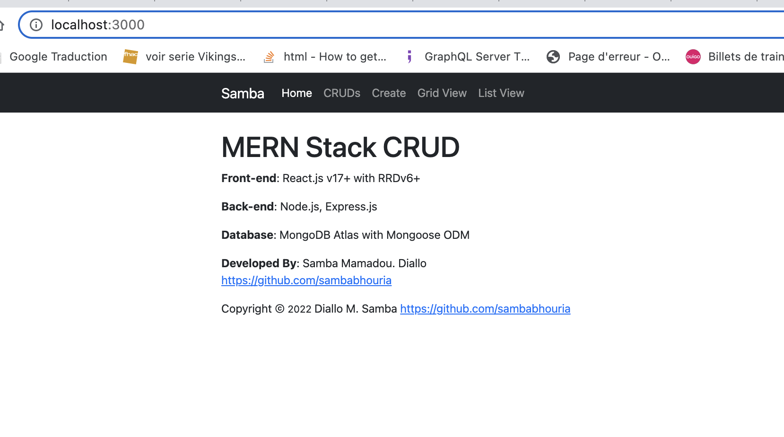
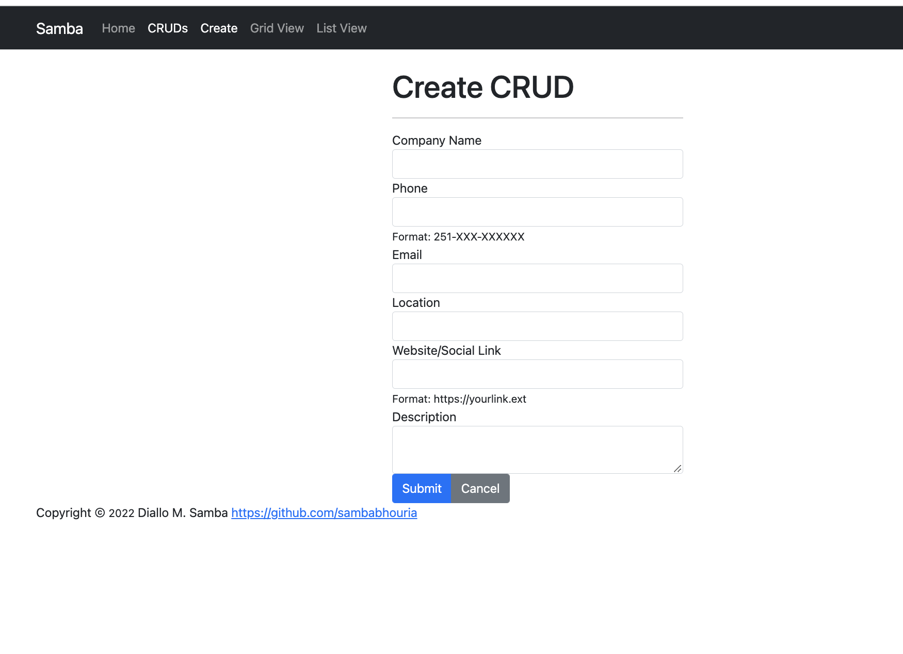
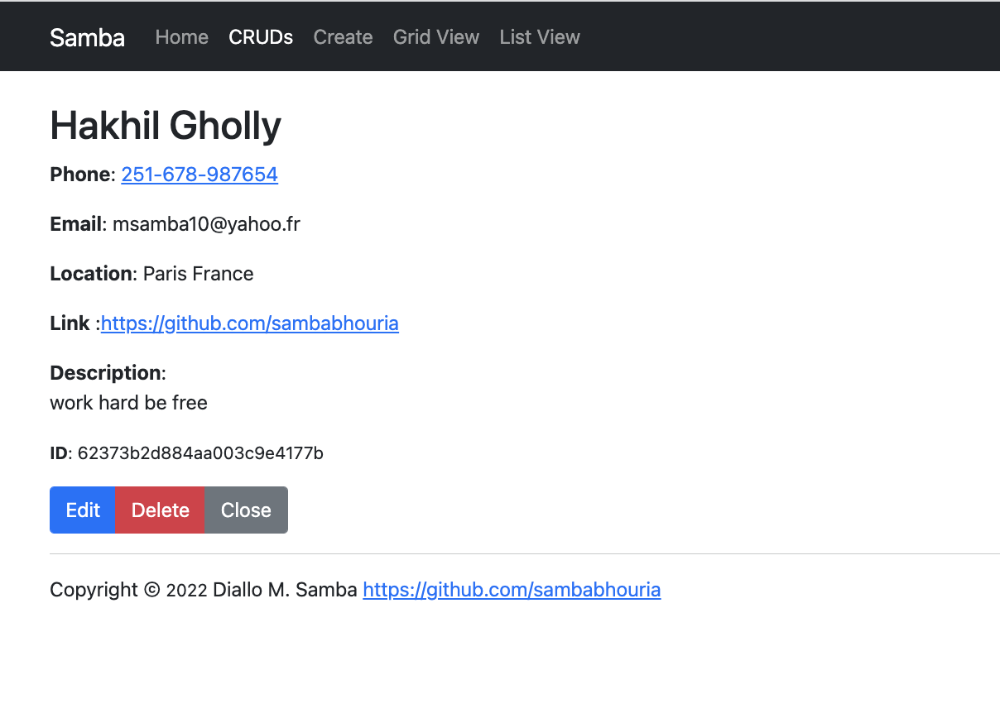
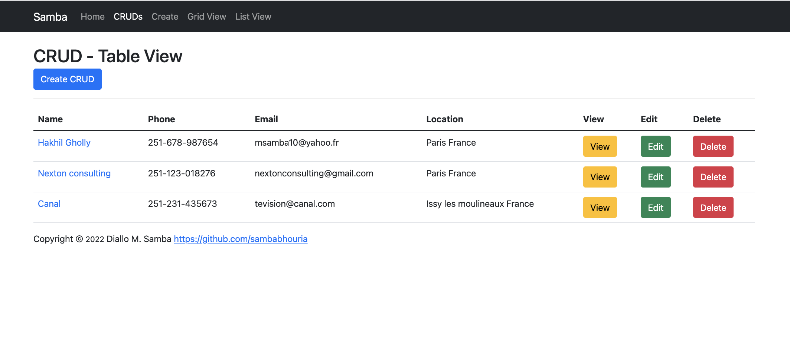
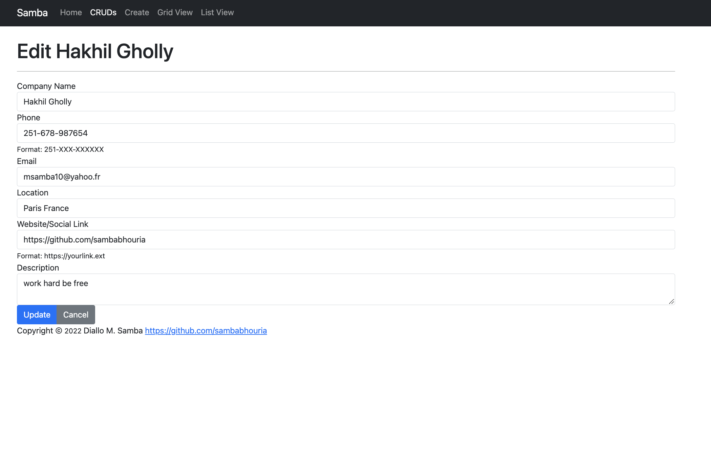
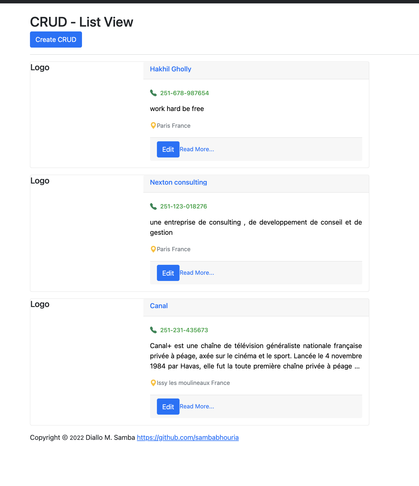

🤘 MERN Stack CRUD Application

Free and open-source MERN Stack CRUD Application built with React v17+, RRDv6+, Node.js, Express.js MongoDB and Mongoose ODM.
You can import the JSON File named 'Cruds' to your MongoDB. You will find it in the Server Folder

# Home:  Topics
 

# CRUD Form
##  Here you can create new data
 

 # Details View
  ## Details view by Id
   

# List View
## This is an optional List View

# Edit View
## This is an edit view

# Grid View
## This is an optional Grid View
### Divided to 4 Cols
### Clickabel Phone and Web URL

